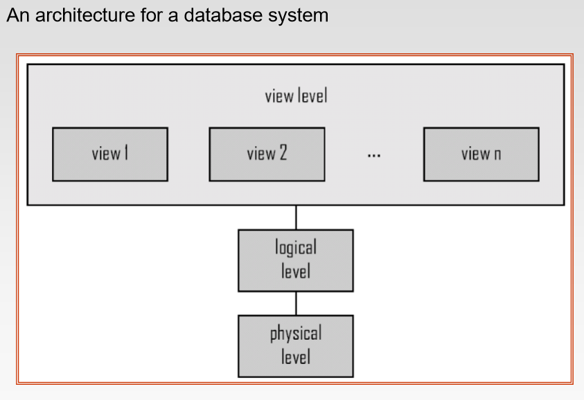
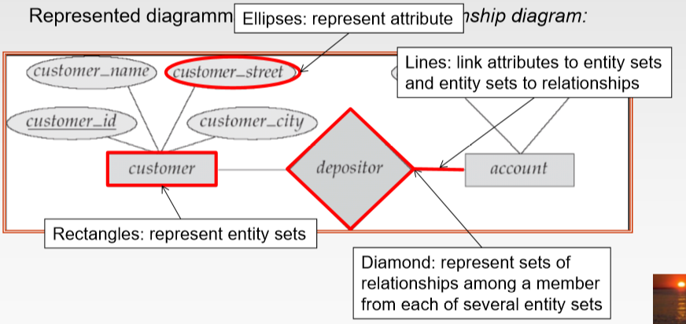

# Introduction

## Drawbacks(缺陷) of using file systems
- Data redundary and inconsistency(数据冗余和不一致)
- Difficulty in accessing data
- Data isolation(数据隔离)
- Integrity(完整性) problems(一致性约束)
- Atomicty problems
> 书上举了一个例子，A转50美刀给B，在转的过程中避免A已经扣除50美刀，但B没收到，要保证原子性 

- Concurrent-access anomalies(并发访问异常)
- Security problems

## Databases system
- A databases system is a collection of interrelated(相关) data and a set of programs
that allow users to access and modify these data.
> 数据库系统： 相关数据和数据获取修改程序集合 

## Levels of Abstraction
- `Physical level`: describes how a record is stored.
- `Logical level`: describes data stored in database, and relationships among the data.
- `View level`: application programs hide details of data types. Views can also hide
information (such as password, employee's salary) for security purposes.
 

## Data Models
- Relations Model
- The Entity-Relationship Model
- Object-Based Data Model
- Semistructured(半结构化) Data Model(XML)
> XML: Extensible Markup(标记) Language 
> 历史上the network data model and the hierarchical(分级) data model 优于关系数据模型，
但偏于底层实现，而且复杂，所以现在很少用了 

## Database Language
### Data-Manipulation Language(DML)
- `Procedural DMLs`: user specifies what data is required and how to get those data.
- `Declarative DMLs(nonprocedural DMLs)`: user specifies what data is required
without specifying how to get those data
> 数据查询属于 DML 

### Data-Definition Language
- constraints(建表约束什么的)
> `Domain Constraints(域约束)`: 建表属性类型约束，比如整型、字符型、日期型 
> `Referential Inergrity(参照完整性)`: referencesconstraint in SQL 
> `Assertions(断言)`: 数据库总是遵循的条件 
> `Authorization(授权)`: 针对不同用户的不同权限约束 
 
> The query language of SQL is nonprocedural.就是说SQL不是程序语言，那可以说是脚本吧 

## The Entity-Relationship Model
> 一张图解决问题 

 

## Storage Manager
- A `Storage manager` is a program module that provides the interface between the
low-level data stored in the database and the application programs and queries
submited to the system.
> 简单的说就是一个提供底层数据储存和高层应用程序、查询操作之间接口的程序模块 

- Storage Manager Components
> Authorization and integrity manager 
> Transaction(事件) manager 
> File manager 
> Buffer manager 

## Database Architecture
- Centralized(集中式)
- Client-Server
- Parallel(multi-processor)
- Distributed(分布式)
