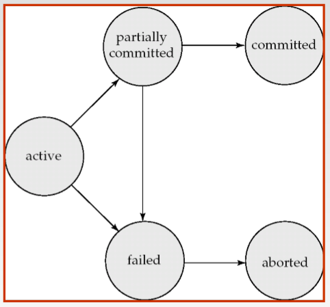

# Transactions

## Transaction Concept
- A `Transaction` is a unit of program execution that accesses and possibly updates
various data items.
- Properties of the transactions:(ACID属性)
> Atomicity(要么都没有做，要么都完成)<br>
> Consistency(隔离执⾏行事务时要保证一致性)<br>
> Isolation(事务之间只能看到未完成与完成两种状态) <br>
> Durability(事务完成 后，对系统的影响是永久的)<br>

- Transactions access data using two operations:
> read(X)<br>
> write(X)<br>

- Let Ti be a transaction that transfers $50 from account A to account B. This transaction
can be defined as:
```
            Ti:read(X);
               A := A - 50;
               write(A);
               read(B);
               B := B + 50;
               write(B).
```
> `Consistency requirement` – the sum of A and B is unchanged by the execution of the transaction. <br>
>  Ensuring consistency for an individual transaction is the responsibility of the
application programmer who codes the transaction<br>

- States of transaction:
> Active<br>
> partially committed<br>
> Failed<br>
> Aborted(中止)<br>
> committed<br>

<br>
- Two options after it has been aborted:
> It can `restart` the transaction, but only if the transaction was aborted as a result
of some hardware or software error that was not created through the internal logic of
the transaction. A restart transaction is considered to be a new transaction.<br>
> It can `kill` the transaction. It usually does so because of some internal logical
error that can be corrected only by rewriting the application program, or because
the input was bad, or because the desired data were not found in the database.<br>

## Concurrent Executions(并发执行)
- Good reason for allowing concurrecy:
> Improved throughout and resource utilization(提高吞吐量和资源利用率)<br>
> Reduced waitting time(减少等待时间)<br>

## Recoverability
- Recoverable Schedules(可恢复调度)
> A `recoverable schedule` is one where, for each pair of transactions Ti and Tj such
that Tj reads a data item previously written by Ti, the commit operation of Ti appears
before the commit operation of Tj.<br>

- Cascadeless Schedules(无级联调度)
> A `cascadeless schedule` is one where, for each pairs of transactions Ti and Tj
such that Tj reads a data item previously written by Ti, the commit operation of Ti
appears before the read operation of Tj.<br>

建议看一下书，书上内容也挺重要的<br>
