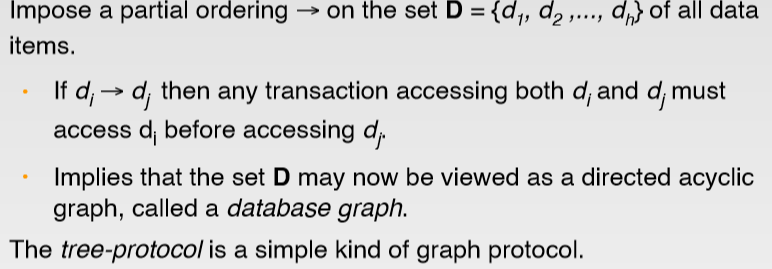
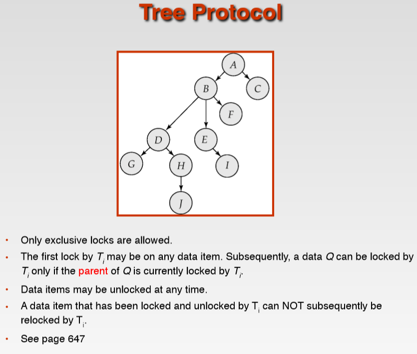

# Concurrency Control

## Locks
- `Shared(S)`. Data item can only be read. S-lock is requested using `lock-S` instruction. (只能读，不能写)
- `Exclusive(X)`. Data item can be both read as well as written. X-lock is requested using `lock-X` instruction.（读写均可）

## Lock-Based Protocols
- A `locking protocol` is a set of rules followed by all transactions while requesting
and releasing(释放) locks. Locking protocol restrict the set of possible schedules.

## The Two-Phase Locking Protocol(两阶段锁协议)
- `Growing Phase`: Transaction may obtain locks; transaction may not release locks.
- `Shrinking Phase`: Transaction may release locks; transaction may not obtain locks.
> 第一阶段是获得封锁，也称为扩展阶段。这在阶段，事务可以申请获得任何数据项上的任何类型的锁，但是不能释放任何锁。 
> 第二阶段是释放封锁，也称为收缩阶段。在这阶段，事务可以释放任何数据项上的任何类型的锁，但是不能再申请任何锁。 

> 注意：两段锁协议并不要求事务必须一次将所有要使用的数据全部加锁，因此遵守两段锁协议的事务`可能发生死锁`。 

- `Upgrade`: We denote conversion from shared to exclusive modes by `upgrade`.
- `Downgrade`: We denote conversion from exclusive to shared modes by `downgrade`.

## Graph-Based Protocols
  
 
