# Relationnal Model

## Database Schema(模式)
> Account_schema = (account_number, branch_name, balance) 
> Branch_schema = (branch_name, branch, assets) 
> Customer_schema = (customer_name, customer_street, customer_city) 

## Keys
- `Candidate keys(候选码)`: Such minimal superkeys are called candidate keys.
- `Primary key`: identifying tuples within a relation.
- `Foreign key`: A relation schema may include among its attributes the primary
key of another relation schema. The attribute is called a `foreign key`.
- `Referencing relation(参照关系)`
- `Referenced relation(被参照关系)`
> 提示一下：foreign key 一定是被参照关系的主码 
> 提示一下：Order of tuples is irrelevant(不相干) (tuples may be stored in an arbitrary(随意) order) 

## Fundamental Relational-Algebra Operation(基本关系代数运算)
### The Select Operation
- The `select` operation selects tuples that satisfy a given predicate(谓词).
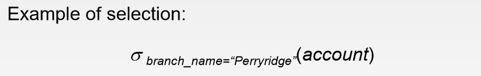 

### The Project(投影) Operation
- Suppose we want list all loan numbers and the amount of the loans, but do not
care about the branch name. The `project` operation allows us to produce this relation.
> 投影操作：取一个属性的所有值或者多个属性的所有值 

 

### The Union(并) Operation
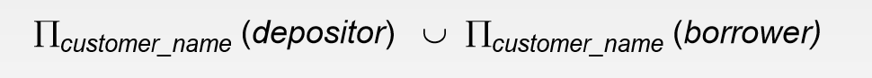 
- The relation `r` and `s` must be of the same arity(元). That is, they must have
the same number of attributes. (两个关系有相同元)
- The domains of the ith attribute of `r` and the ith attribut of `s` must be the
same, for all i. (两个关系的相同元的域相同，即是都是整型或者都是字符型)

### The Set-Difference Operation
- The set-difference operation, denoted by `-`, allow us to find tuples that are in
one relation but not in another.(同样需要满足并操作的条件) 
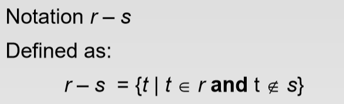 

### The Cartesian-Product(笛卡尔乘积) Operation
- The `Cartesian-Product` operation, denoted by a cross(X), allows us to combine information
from any two relations.
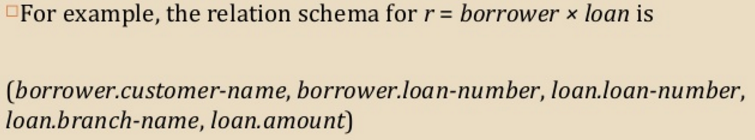 
> For those attributes that appear in only one of the two schemas, we shall usually
drop the relation-name prefix. (就是说只在一个模式里出现的属性可以去掉前缀) 

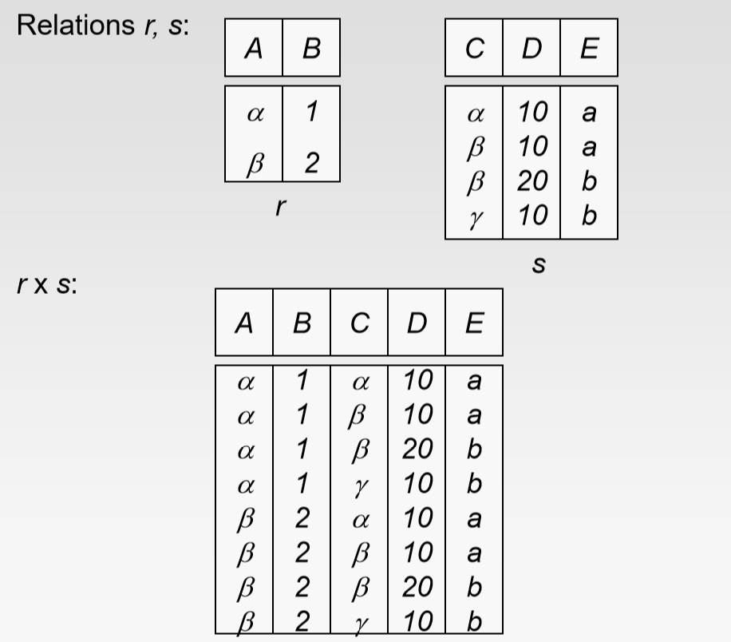 

### The Rename Operation
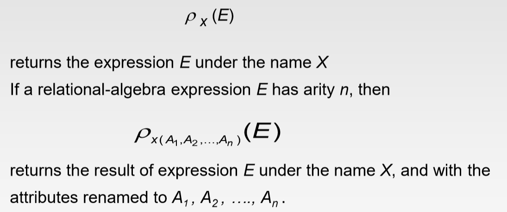 

### Formal Definition of the Relational Algebra
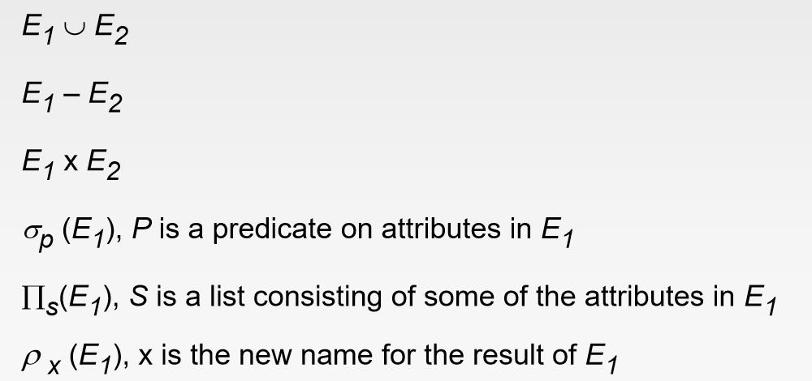 

### The Set-Intersection(交) Operation
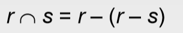 

### The Natural-Join Operation
> 自己总结：笛卡尔乘积后不同关系中形同属性值相同的留下就是自然连接的结果 

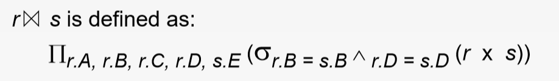 

### The Division Operation
> 笛卡尔乘积的相反方向 

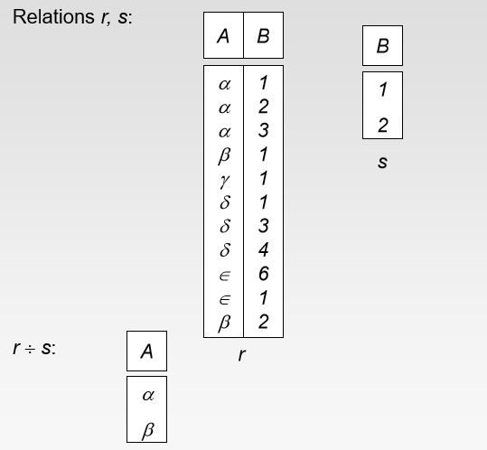 

### The Assignment Operation
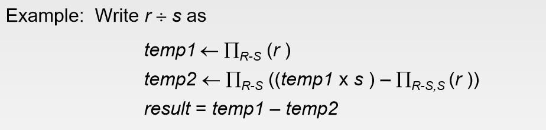 

### Aggregate Functions
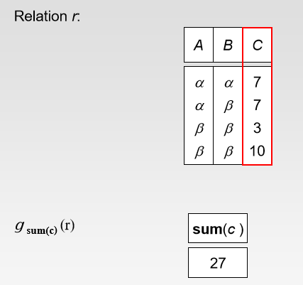 
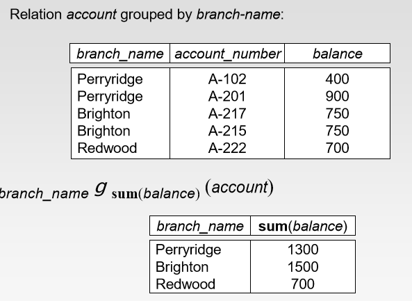 

## Null Values
- 数学运算符对null操作的结果仍然为null
- 两个null值被认为是一样的 
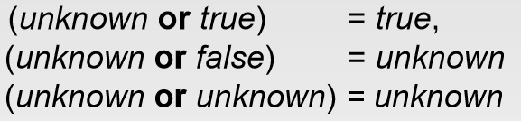 
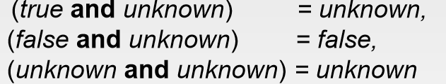 
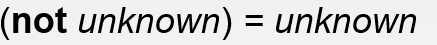 

## Modification of the Database
### Deletion
 
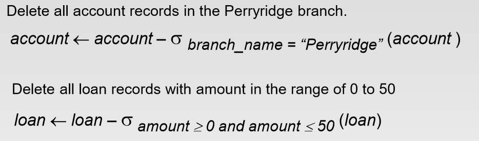 

### Insertion
 
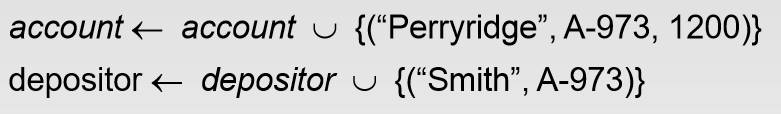 

### Update
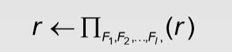 
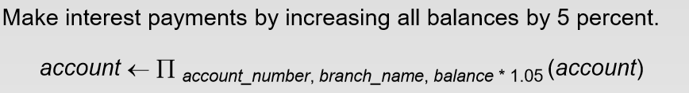 
