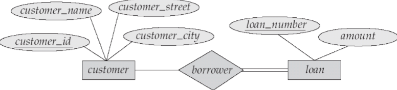
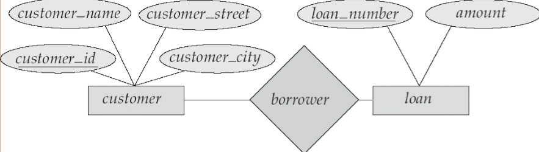
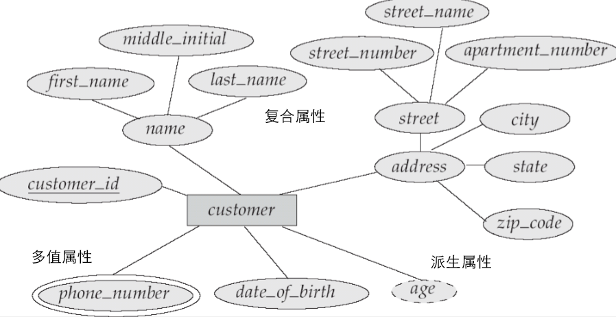
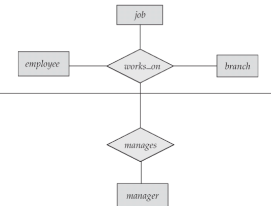

# Database Design and the E-R Model

## The Entity-Relationship Model
- `Entity`: A entity is a 'thing' or 'object' in the real world that is distinguishable
from all other object.
- `Attributes`: An entity is represented by a set of attributes.
- `Relationship`: A relationship is an association among several entities.

## Constraints(约束)
- Mapping cardinality(映射基数)
> One-to-one 
> One-to-many 
> Many-to-one 
> Many-to-Many 

## Entity-Relationship Diagrams
- `Rectangles(矩形)`, which represent entity sets
- `Ellipses(椭圆)`, which represent attributes
- `Diamonds(菱形)`, which represent relationship sets
- `Lines`, which link attributes to entity sets and entity sets to relationship sets
- `Underline` indicate primary key attributes
- `Double ellipses`, which represent multivalued(多值) attributes
- `Dashed ellipses`, which denote derived attributes(通过其他属性计算得来)
- `Double lines`, which indicate total participation of an entity in a relationship set
 
> A double line from loan to borrower, indicates that each loan must have at least one
associated customer. 

- `Double rectangles`, which represent weak entity sets
  
 
> A directed line(-->) signifying "one" 
> An undirected line(--) signifying "many" 

> An edge between an entity set and a binary relationship set can have an associated
minimum and maximum cardinality, shown in the form `l..h`, where `l` is the min and
`h` is the max cardinality. 

## Entity-Relationship Design Issues
- `Use of Entity Sets versus(vs.) Attributes`
> 书上举了一个例子：关于用户的电话号码应该是一个属性还是应该是一个实体 
> 如果将电话号码看成一个属性，那么一个人可能会有多个号码，而且号码也去分区域，造成了设计困难 
> 相反如果将电话号码堪称一个实体，那么一个人可以有多个号码的一对多映射基数，号码区域可以看作电话实体的一个属性 

- `Use of Entity Sets versus(vs.) Relationship Sets`
> 书上举了一个例子：关于贷款应该是一个实体还是应该是一个关系 
> 如果将贷款看作是关系，将loan_number和amount看作是关系的属性，看起来这个设计还行 
> 但是当不同的用户拥有同一个贷款即几个人分享同一个贷款时就是出现数据重复储存，也会在更新时出现不一致情况 

- `Binary versus(vs.) n-ary Relationship Sets`
> 书上举了一个例子：关于employee, branch, job以及关系work_on对应关系问题 
> 我们不能直接将work_on关系割裂为employee和branch之间的关系以及employee和job之间的关系 
> 如果割裂了，我们只能表示一个人在Perryridge和Downtown都是manager和auditor，但不能表示
> 一个人在Perryridge是manager，在Downtown是auditor。为了将work_on割裂，可以重新创建一个
> 实体，但是这样做并不是非常自然。 

- `Placement of Relationship Attributes`
> 个人理解：之前提过关系属性，但是关系属性具体怎么实现的，我不太清楚，而这里就是将关系属性
> 放置掉，不用或者少用关系属性 

## Weak Entity Sets
- An entity set may not have sufficient attributes to form a primary key. Such an entity
set is termed a `weak entity set`.
- `Weak entity set` does not have a primary key.
- The existence of weak entity set depends on the existence of a `identifying entity set`
- `discriminator(鉴别)`  distinguishes among all the entities of a weak entity set

## Aggregation(聚合)
- E-R Model cannot express relationships among relationships.
- `Aggregation` is an abstraction through which relationship are treated as higher-level
entities.
> 实体关系模型不能表示关系之间的关系，因此将关系抽象为更高级别的实体 

 

之后是是银行的数据库设计，在实际项目中很有借鉴价值，但应对考试暂时可能不太需要
