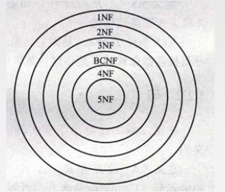
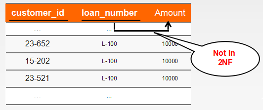

# Relational Database Design

## Normal Forms(范式)
- A set of conditions on table structure that improves maintence 
 

## Atomic Domains and First Normal Form
- A domain is `atomic` if elements of the domain are considered to be indivisible(不可分割的)
units.
- We say that a relation schema R is in `first normal form`(1NF) if the domains of
all attributes of R are atomic.(and it has a primary key)
> 保证关系模式中所有的属性都是不可再分的范式就是第一范式 

## Decomposition Using Functional Dependencies
- `Superkey`: A subset K of R is a superkey of R if, in any legal relation γ(R), for
all pairs t1 and t2 of tuples in γ such that t1 != t2, then t1[K] != t2[K].
- `Functional Dependencies`: α ——> β holds on schema R if, in any legal relation γ(R),
for all pairs of tuples t1 and t2 in γ such that t1[α] = t2[α], it is also the case
that t1[β] = t2[β].
> 老师提供的ppt上有个很有意思的东西： 

 
> 这想说明什么呢？难道是为了给后面的概念做铺垫？最主要的是没有下文了 

- `Closeure`:The set of all functional dependencies logically implied by F is the closure of F.
> We denote the closure of F by F+;  
> F+ is a superset of F. 

## Second Normal Form
- A relation schema R is in `Second Normal Form` if
> 1.it is in 1NF 
> 2.it includes no partial dependencies; that is, no attribute is dependent on only
a portion of the primary key.(不包括部分依赖，即没有属性只依赖主码的一部分) 

 
