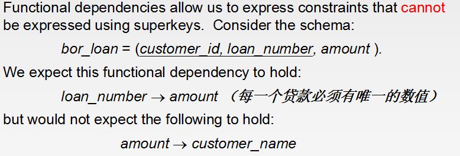
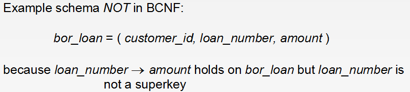

# Relational Database Design

## Normal Forms(范式)
- A set of conditions on table structure that improves maintence 
 

## Atomic Domains and First Normal Form
- A domain is `atomic` if elements of the domain are considered to be indivisible(不可分割的)
units.
- We say that a relation schema R is in `first normal form`(1NF) if the domains of
all attributes of R are atomic.(and it has a primary key)
> 保证关系模式中所有的属性都是不可再分的范式就是第一范式 

## Decomposition Using Functional Dependencies
- `Superkey`: A subset K of R is a superkey of R if, in any legal relation γ(R), for
all pairs t1 and t2 of tuples in γ such that t1 != t2, then t1[K] != t2[K].
- `Functional Dependencies`: α ——> β holds on schema R if, in any legal relation γ(R),
for all pairs of tuples t1 and t2 in γ such that t1[α] = t2[α], it is also the case
that t1[β] = t2[β].
> 老师提供的ppt上有个很有意思的东西： 

 
> 这想说明什么呢？难道是为了给后面的概念做铺垫？最主要的是没有下文了 

- `Closeure`:The set of all functional dependencies logically implied by F is the closure of F.
> We denote the closure of F by F+;  
> F+ is a superset of F. 

## Second Normal Form
- A relation schema R is in `Second Normal Form` if
> 1.it is in 1NF 
> 2.it includes no partial dependencies; that is, no attribute is dependent on only
a portion of the primary key.(不包括部分依赖，即没有属性只依赖主码的一部分) 

 

## Boyce-Codd Normal Form(BCNF范式)
  
 

## Third Normal Form
- A relation schema R is in `third normal form` with respect to a set F of functional
dependencies if, for all functional dependencies in F+ of the form α -> β, at least
one of the following holds:
> 1. α -> β is a trivial(平凡) functional dependency. 
> 2. α is a superkey for R. 
> 3. Each attribute A in β - α is contained in a candidate key for R.  

> 书上看了半天也没懂，所以在网上搜了一下，有一个讲得挺好的 

[Normal Forms](http://www.cnblogs.com/ybwang/archive/2010/06/04/1751279.html) 
补充：
> 1NF 消除非主属性对码的部分函数依赖就是 2NF 
> 2NF 消除非主属性对码的传递函数依赖就是 3NF 
> 3NF 消除了主属性对码的部分和传递函数依赖就是 BCNF 
