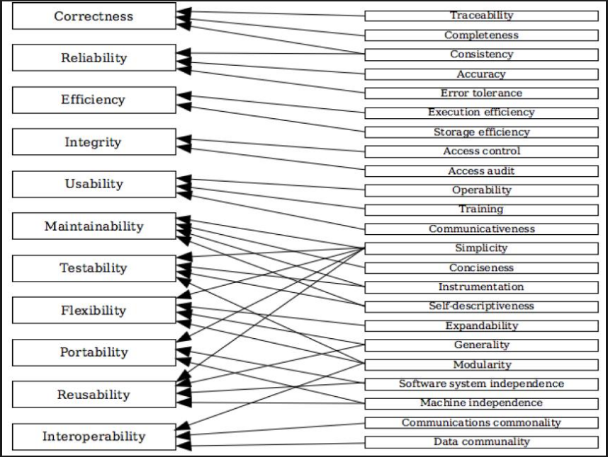

# Why Software Engineering?

## Software
- Instruction
- Data Structure
- Documents

## Engineering
- analysis
- design
- construction
- verification(验证)
- management of technical entities(技术实体管理)

## Software Engineering
- (1) The application of a systematic, disciplined,  Measureable approach to the
development, operation, and maintenance of software. That is, the application of
engineering to software.
- (2)The study of approaches as in (1)
- 将系统化的、规范的、可度量的方法应用于软件开发、运行可维护的过程，即将工程化应用于
软件中。以及（1）所述方法的研究。

## Software Quality
- Product Quality
- Process Quality
- Business Quality(Quality in the context of the business Environment)

## who does Software Engineering?
- The `customer` is the company, organization, or person who is paying for the
software system to be developed.
- The `developer` is the company, organization, or person who is building the
software system for the customer.
- The `user` is the person or people who will actually use the system:the ones sit
at the terminal or submit the data or read the output.

## McCall Model

## Elements of System
- Activities and Objects
- Relationships and the System Boundary
- Examples of System

## development of software includes the following activities
- requirements analysis and defination
- system design
- program design
- writing the program(program implementation)
- unit testing
- integration testing(集成测试)
- system testing
- system delivery
- maintenance
