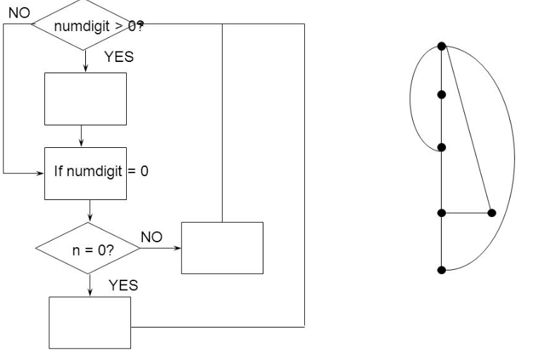

# Maintaining the System

## Types of System
- S-system
> `Formal Defined` 
> `Static` 
> `Solution is Well-know` 
> Example: Matrix Manipulation(矩阵运算器) 

- P-system
> `Abstratic Problem` 
> `Dynamic`(动态) 
> `On Approximation`(求不出精确解，只是逼近精确解) 
> Example: Play Chess(下棋) 

- E-system
> `Real World Situation` 
> `Update` 
> `Solution depends model` 
> Example: Predicts a Country's Economic Health(预测一个国家经济健康状况) 

## Types of Maintenance
- Corrective Maintenance
- Adaptive Maintenance(适应性维护)
- Perfective Maintenance(完善性维护)
- Preventive Maintenance(预防性维护)

## Measuring(度量) Maintenance Characteristics
- `External View of Maintainability`
> The time at which the problem is reported 
> Any time lost due to administrative delay 
> The time required to analyze the problem 
> The time require to specify which changes are to be made 
> The time needed to make the change 
> The time needed to test the change 
> The time needed to document the change 

- `Internal Attributes Affecting Maintainability`
> Cyclomatic Number(环路数) 

 
