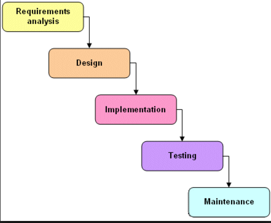
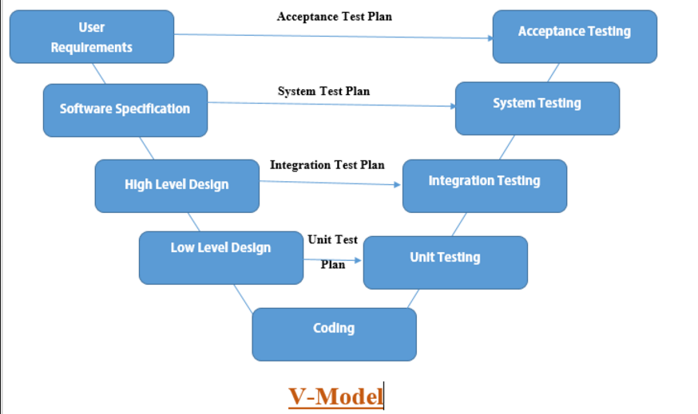
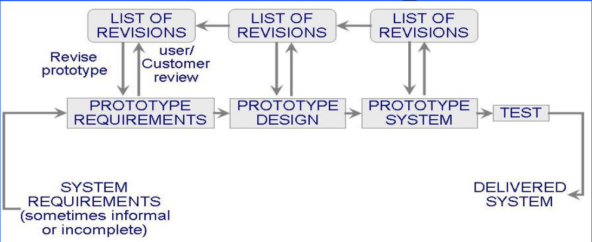
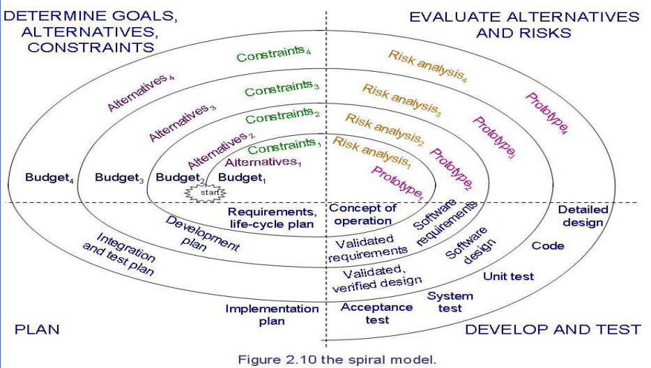

# Modeling the Process and Life Cycle

## Process
  We can think of a set of ordered tasks as a **process**:**a series of steps**
involving activities, constraints, and resources that produce an intended output
of some kind. 
  A Sequence Of Steps, In the Same Order each time.

## life cycle
  When the process involves the building of some product, we sometimes refer to
the process as a life cycle. Thus the software development process is sometimes
called the software life cycle.

## Software Process Models
### Waterfall Model

  **具体步骤**：`requirements analysis` -> `System Design` -> `Program Design` -> `Coding`
-> `Unit & Integration Testing` -> `System Testing` -> `Acceptance Testing` ->
`Opreation & Maintenance` 
  利用瀑布模型开发软件系统时，每一阶段完成确定的任务后，若其工作得到确定，就将产生的文档及
成果交给下一个阶段；否则返回前一阶段，甚至更前面的阶段进行返工。而不同阶段的任务，一般来说
是有不同级别的软件开发人员承担的。 
  **优点**：阶段间具有顺序性和依赖性，便于分工合作，文档便于修改，并有复审质量保证。 
  **缺点**：与用户见面晚、纠错慢、工期延期的可能性大。 
  **适用范围**：该模型适合于在软件需求比较明确、开发技术比较成熟、工程管理比较严格的场合使用。

### V Model

  V模型最终要的是 **The testing activities are related to analysis and design**,即测试团队
的测试活动要与分析、设计团队相关联。 
  **缺陷**：V模型仅仅把测试过程作为在需求分析、系统设计及编码之后的一个阶段，忽视了测试对
需求分析,系统设计的验证，需求的满足情况一直到后期的验收测试才被验证。 
  **适用范围**：V模式是一种传统软件开发模型，一般适用于一些传统信息系统应用的开发，而一些
高性能高风险的系统、互联网软件，或一个系统难以被具体模块化的时候，就比较难做成V模式所需的各
种构件，需要更强调迭代的开发模型或者敏捷开发模型。

### Prototyping Model(原型法模型)

  原型法模型是针对瀑布模型提出来的一种改进方法。它的基本思想是从用户需求出发，快速建立一个原型，
使用户通过这个原型初步表达自己的需求，并通过反复修改和完善，逐步靠近用户的全部需求，最终形成一个
完全满足用户要求的新体系。 
  **优点**：开发人员和用户在“原型”上达成了一致，避免了许多由于不同理解而造成的错误，提高了系统的
实用性、正确性以及用户的满意度。由于是对一个有形的“原型产品”进行修改和完善，即使前面的设计优缺陷，
也可以通过不断地修改原型产品，最终解决问题。缩短开发周期，加快工程进度。 
  **缺点**：不适合大规模系统的开发；开发过程管理要求高，整个开发过程要经过“修改—评价—再修改”的多
次反复；用户过早看到系统原型，误认为系统就是这个模样，易使用户失去信心；开发人员易将原型取代系统
分析；缺乏规范化的文档资料。 
  **适用范围**：处理过程明确、简单系统；涉及面窄的小型系统。 
  **不适用范围**：大型、复杂系统，难以模拟；存在大量运算、逻辑性强的处理系统；管理基础工作不完善、
处理过程不规范；大量批处理系统

### Spiral Model(螺旋模型)

  螺旋模型将瀑布模型和原型模型结合起来，并加入了风险分析，构成具有特色地模式，弥补了前两种模型地不足，
使演化模型地一种具体形式。螺旋模型将工作划分为4个主要活动：制定计划、风险分析、实施工程、用户评价。
4个活动螺旋式地重复执行，知道最终得到用户认可地产品。 
  **优点**：关注软件地重用；关注早期错误的消除；将质量目标放在首位；将开发与维护集合在一起。 
  **缺点**：需要风险分析评估的经验，契约开发通常需要事先指定过程模型和发布产品；建设周期长，而软件技术
发展比较快，所以经常出现软件开发完毕后，和当前的技术水平有了较大的差距，无法满足当前用户需求。 
  **适用范围**：对于新近开发，需求不明确的情况下，适合用螺旋模型进行开发，便于风险控制和需求变更。
