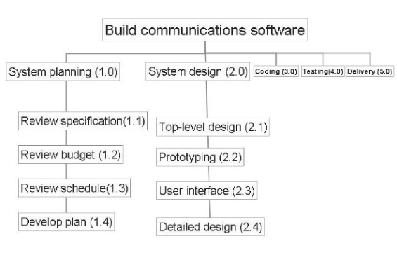
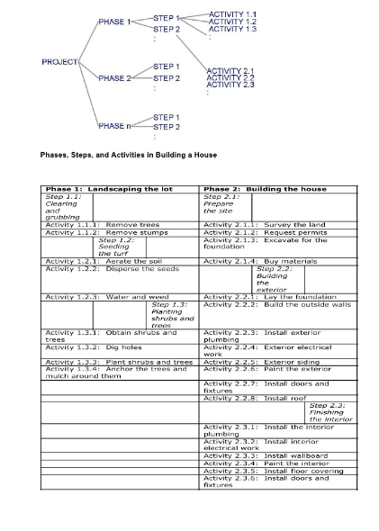
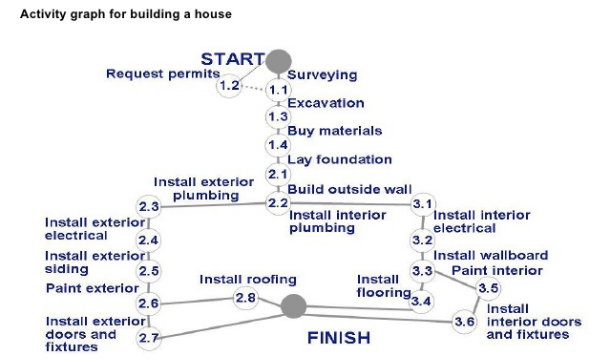
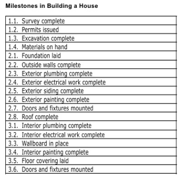
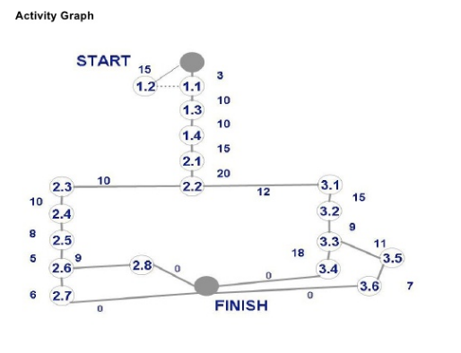
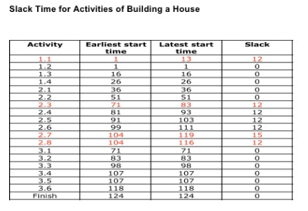
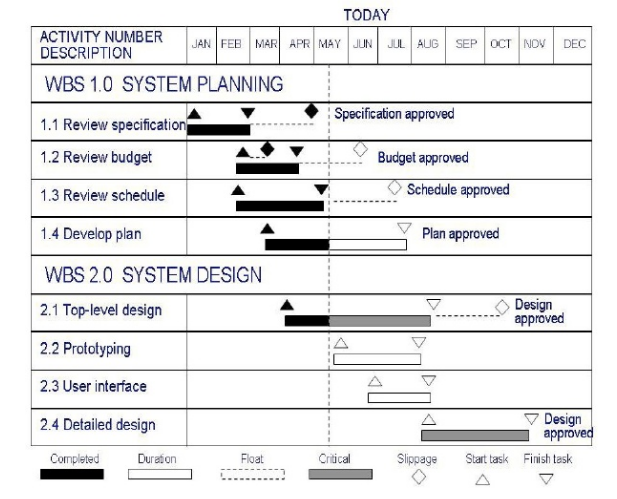

# Planning and Managing the Project

## Basic Conceptions
- `Project Schedule`:The Software Development Cycle for a particular project by
enumerating the phases or stage of the project and breaking each into discrete
tasks or activities to be done.
> 项目进度：通过列举项目的阶段或阶段，将每个项目分解为要完成的离散任务或活动的特定项目软件开发周期

- `Activity `:A part of the project that take place over a period of time.
> 活动：项目的一部分，在一段时间内发生

- `Milestone`:A particular point of time, the completion of an activity.
> 里程碑：活动完成的特定时间点

## WBS
> WBS:Work Break-down Structure(工作分解结构) 
> From up to down and refinement(自顶向下，逐步求精)

 
 
 
 

## CPM
- `Critical Path Method`:Analyzing the paths among the milestones of a project in
this way is called the **Critical Path Method**. The paths can show us the minimum
amount of time it will take to complete the project, given our estimates of each
activity's duration.
> 分析项目里程碑之间的路径,这种方式称为关键路径方法。根据我们对每个项目活动持续时间的估计，
> 路径可以显示我们的完成项目的最短时间。

- `real time` or `actual time`: the estimated amount of time required for the
activity to be completed.
- `available time`: the amount of time available in the schedule for the activity's
completion.
- `Slack time` or `float time`: the difference between the available time and real
time for that activity:
> Slack time = available time - real time
> Slack time = latest start time - earliest start time

 
 

- `critical path`: the one for which the slack at every node is zero.
> 关键路径：路径上每一个节点的浮动时间为 0 。也是起点到终点最长的一条路径。

## Gantt chart
 

## Individual abilities
- ability to perform(执行) the work
- interest in the work
- experience with similar application
- experience with similar tools or languages
- experience with similar techniques
- experience with similar development environment
- training
- ability to communcation with others
- ability to share responsibility with others
- management skills
