# Capturing the Requirements(捕捉需求)

## Requirements defination
- `requirements`: a requirements is an expression of desired behavior
> requirements focus on the customer needs, not on the solution or implementation

Process for capturing the requirements:
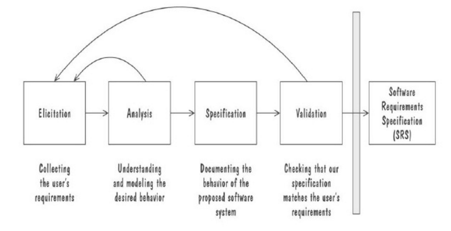 

## Requirements Types
- `Functional`: describes required behavior in terms of required activities
> **功能需求**：描述需求活动的需求行为，比如输出行为、活动执行前后实体状态等。 

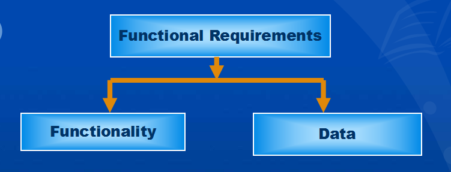 
- `Quality requirements or nonfunctional requirements`: describes some quality
characteristic that software solution must possess
> **质量需求或非功能需求**：描述一些软件解决方案必须具备的品质特点，比如快速反应时间、
> 用例、高可靠性、低维护成本。

- `Design constraint(设计约束)`: a design decision
> **设计约束**：设计决定，比如平台选择、接口组成、操作环境选择。

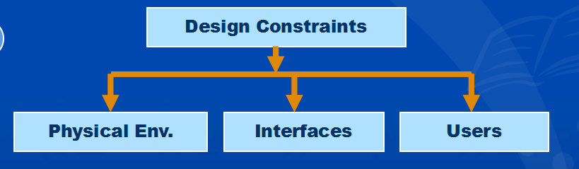 
- `Process constraint(过程约束)`: a restriction on the techniques or resources that
can be used to build the system
> **过程约束**：对可以用来构建系统的技术或资源限制，比如我们持续添加功能时，用户坚持要求适用早期版本，

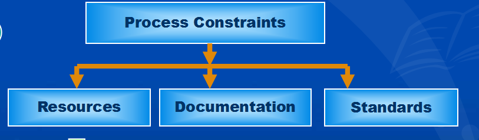  
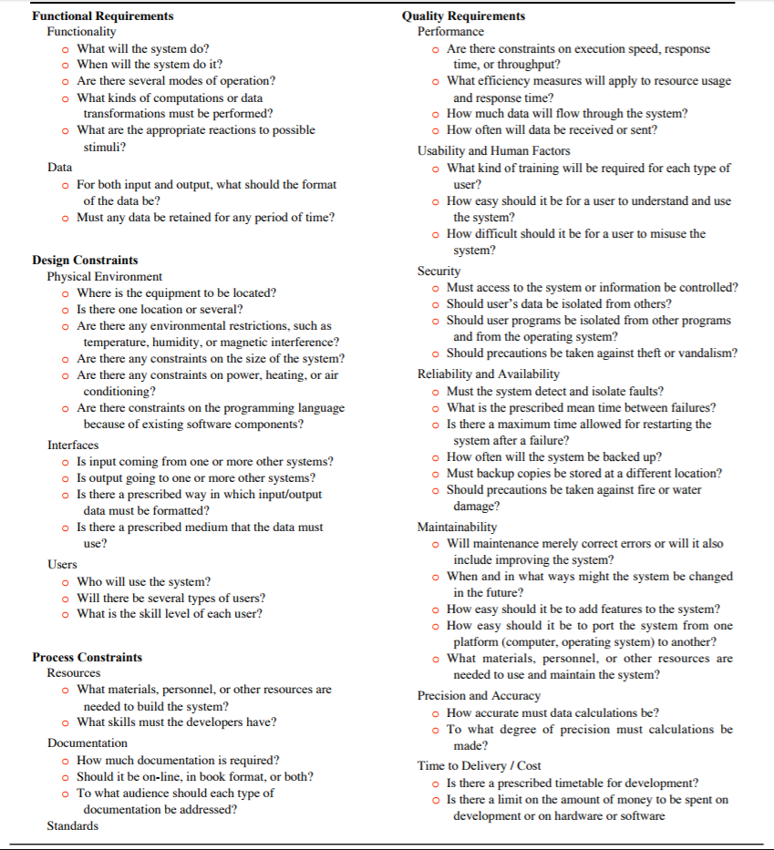 
听说这张图要出题，书上`P150`

## Sources of Requirements
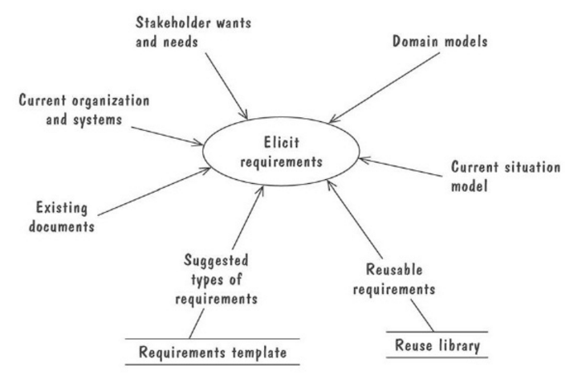 
- 名词解释
> Elicit Requirements: 引出需求 
> Stakholder: 利益相关者 

## Characteristic of Requirements
- Correct(正确)
- Consistent(一致)
- Unambiguous(明确)
- Complete(完整)
- Feasible(可行)
- Relevent(相应、贴题)
- Testable(可测试)
- Traceable(可追踪)

## Modeling
- `Data`: Entity-Relationship Diagrams
- `Function`: Data-Flow Diagrams
- `Behavior`: State Machines

## Entity-Relationship Diagrams
- `entities`: real-world objects that have common properties and behaviors.
- `attributes`: annotation(注释) on entity that describes data or properties associated
with the entity.
- `relations`: the association between two entities.
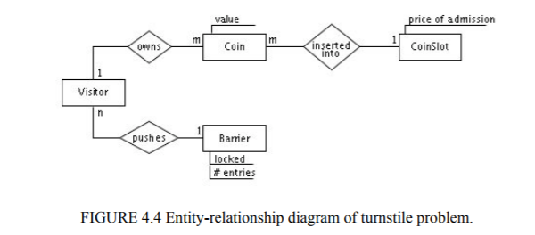 
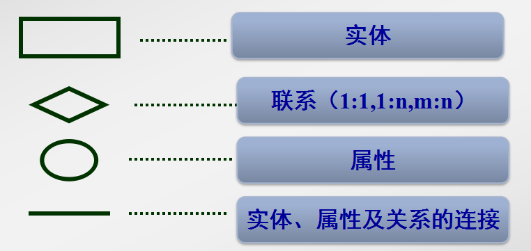 
> Example: UML Class Diagrams(UML--统一建模语言)

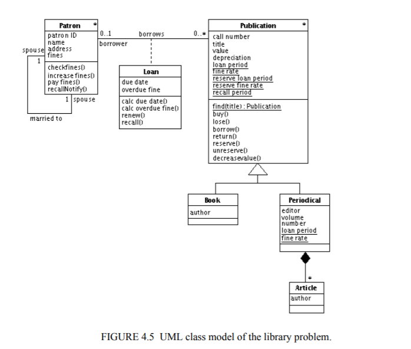 

## State Machines(状态机)
- `State Machine`: A **State Machine** is a graphical description of all dialog
between the system and environment.
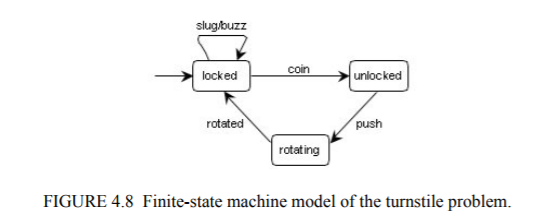 
> Example: UML Statechart Diagrams

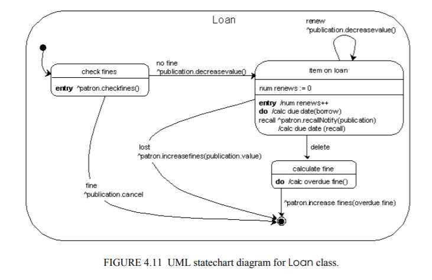 

## Data-Flow Diagrams(DFD)
- `Data-Flow Diagrams`: models Functionality and the flow of data from one function
to another.
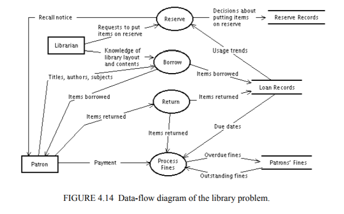 
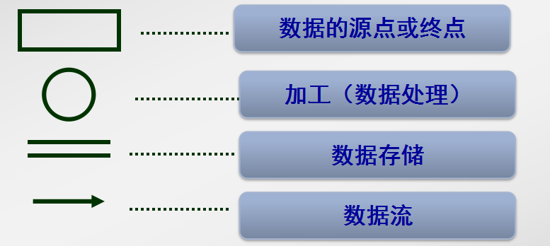 
> Example: Use Cases(用例图)

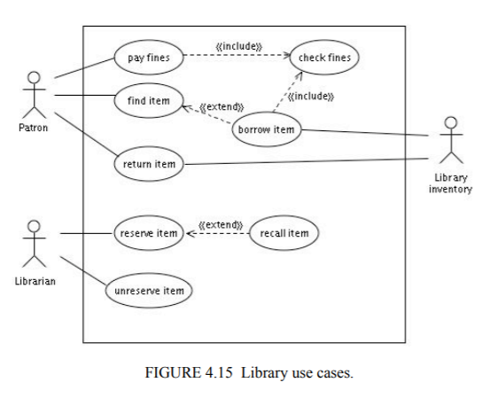 
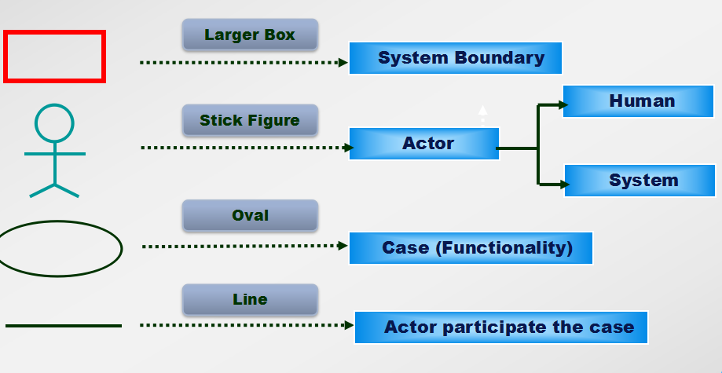 

## Algebraic Specifications(代数规格)
- `Algebraic Specifications`: to specify the behavior of operations by specifying
the interactions between pairs of operations rather thanmodeling individual operations
> 恕我直言，不太清楚这到底是干嘛的，没用过

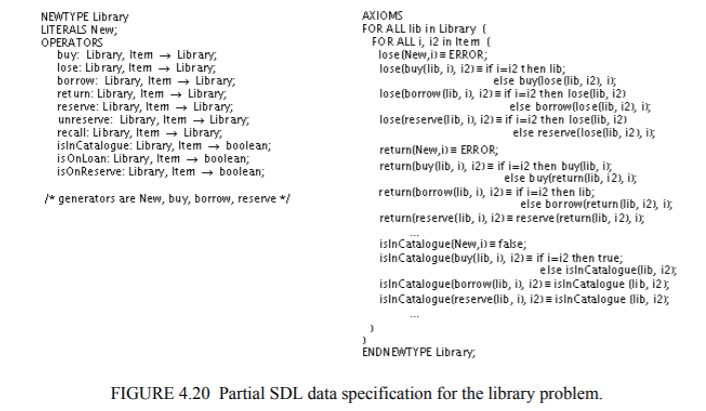 

## Requirements Documents
- `Requirements Defination Documents` --> `Customer`
- `Requirements Specification(规范) Documents` --> `Developer`
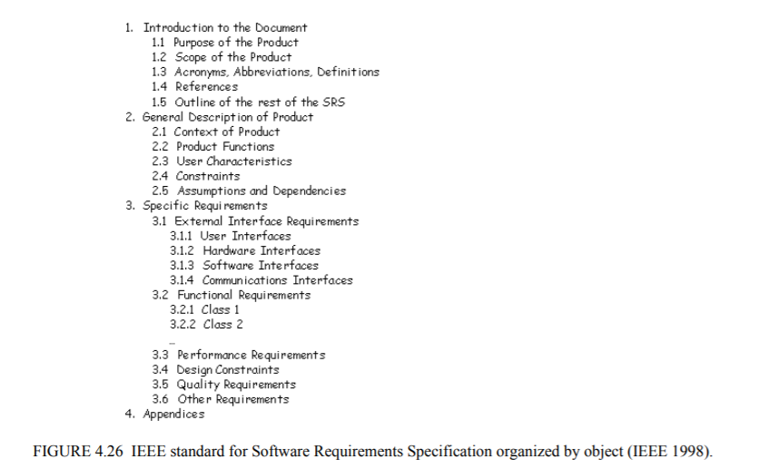 

## Criteria for Evaluating Specification Method(评估规格方法的标准)
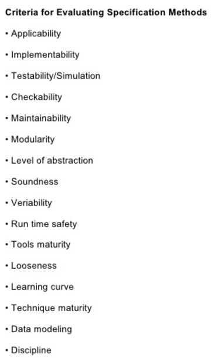 
