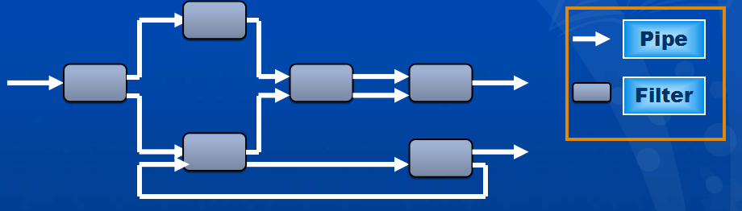
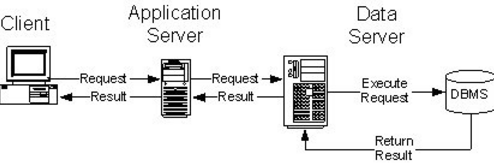
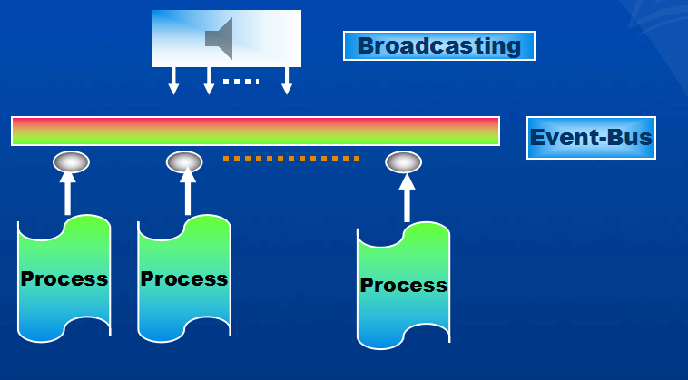

# Designing the Architecture(体系结构设计)

## Software Design
- Architecture Designing
- Module Designing

## Design
- `Design` is the creative process of figuring out how to implement all of customer's
requirements; the resulting plan is also called the design.

## Software Architecture
- `构件`：可以是一组代码，如程序模块，也可以是一个独立运行的程序，如数据库服务器。
- `连接件`：可以是过程调用，管道，远程调用等，用于表示构建之间的相互作用。
- `约束`：对象的连接规则。

## Descriptions of popular Design Method
- `Functional decomposition`
- `Feature-oriented decomposition`
- `Data-oriented decomposition`
- `Process-oriented decomposition`
- `Event-oriented decomposition`
- `Object-oriented decomposition`

## Software Units
- `component`
- `subsystem`
- `runtime process`
- `module`
- `class`
- `package`
- `library`
- `procedure(程序)`

## Architecture Styles And Strategies(体系结构风格和策略)

### Pipe-and-Filter(管道过滤器)
- `Pipes` are connectors that simply transmit data from one filter to the next without
modifying the data.
 

### Client-Server
- `Server` components offer services, and `clents` access them using a request/reply protocol
 

### Peer-to-Peer or P2P(点对点)
- `P2P` architecture is one in which each component executes as its own process and
acts as both a client of and a server to other peer components.

### Publish-Subscribe(发布订阅)
- A component expresses interest in an event by `subscribing` to it. Then, when another
component announces(`publish`) that the event has taken place, the subscribing components
are notified.
> Example: 新闻兴趣订阅、广播与接受广播

 

### Repositories(库)
- A `repository` style of architecture consists of two types of components: a central data
store and associated data-accessing components.

### Layering(层次化)
- `Layered systems` organize the system's software units into layers, each of which
provides services to the layer above it and acts as client to the layer below.
> Example: 网络分层路由。 
> 因特网协议栈共有五层：应用层、传输层、网络层、链路层和物理层

### Architecture Quality Attributes(体系结构质量属性)
- `Modifiability`
- `Performance`
- `Security`
- `Reliability`
- `Robustness(稳健性)`
- `Usability`
- `Business Goals`
> 体系结构模式实现质量目标：可修改性、性能、安全性、可靠性、健壮性、可用性、商业目标
