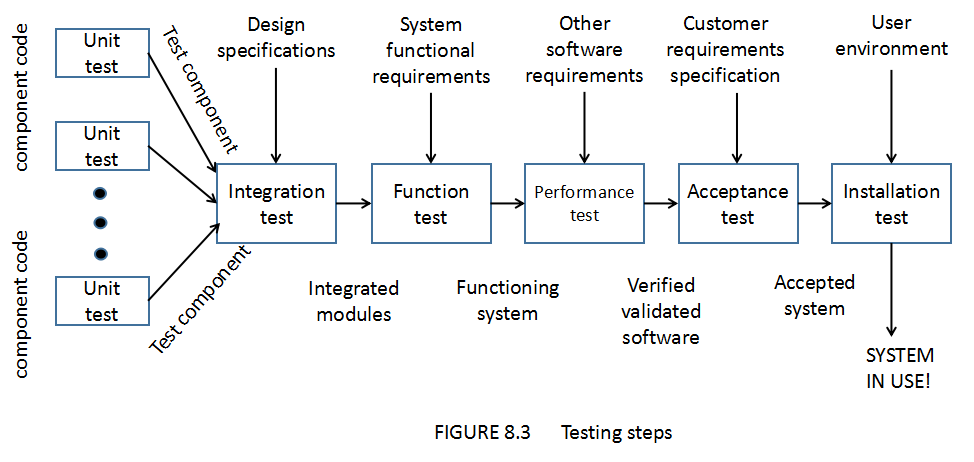

# Testing the Programs

## Test
- `Test`: 为发现软件错误而执行程序的过程

## Software Failure
- `Failure`: A failure is a departure from the system's design
> 不太理解什么意思，departure 查了一下是离开出发的意思；暂时理解为软件失败是设计问题

## Failure Reasons
- The specification may be wrong or have a missing requirement
- The specification may contain a requirement that is impossible to implement
- The system design may contain a fault
- The program design may contain a fault
- The program code may be wrong

## Fault Solving
- `Fault identification` is the process of determining what fault ot faults caused
the failure
- `Fault correction` or `removal` is the process of making changes to the system so
that the faults are removed.

## Types of Faults
- Algorithms faults
- Syntax faults
- Computation and precision faults(计算和精度故障)
- Documentation faults
- Stress or overload faults
- Capacity or boundary faults
- Timing or coordination faults(协调故障)
- Throughput or Performance faults(吞吐量或性能故障)
- Recovery faults(恢复故障): can occur when a failure is encountered(遭遇) and the
system does not behave as the designers or as the customer requires.
- Hardware and system software faults
- Standards and procedure faults

## Testing Steps
 

## Closed box or black box
- whose contents are unknown, our testing feeds input to the closed box and notes
what output is produced. In this case, the test's goal is to be sure that every
kind of input is submitted, and that the output observed matches the output expected.
- **测试内容**：功能测试

## Open box or white box
- To overcome this problem, we can instead view the test objects as an `open box`;
then we can use the structure of the test object to test in different ways. For
example, we can devise test cases that execute all the statements or all the control
paths within the component(s) to be sure that test object is working properly.
- `语句覆盖`：每一可执行语句至少执行一次
- `判定覆盖`：判定分支取真和假各执行一次
- `条件覆盖`：判定的每个条件的可能取值至少执行一次
- `路径覆盖`：程序流程中的独立路径各执行一次

## Unit Testing
- Test Object: component
- Test Steps:
> Examine code by reading through --> Find algorithm, data, syntax 
> Complier the code --> Find remaining syntax faults 
> Develop Test Case --> Find desired faults 

- Test Method:
> Examing the Code  
> Proving Code Correct (书上写着的，老师说去掉) 
> Test Program Component 

### Example the Code
- Code Walkthroughs
> Present code and documentation to test team(递交代码和文档给测试团队) 
> Team comments their correctness(团队评论代码和文档的正确性) 

- Code Inspections(检查)
> Step1: Meet the group: goals 
> Step2: Individually second goal  
> Inspect the code  
> Group meeting: report 

### Test Program Component
- According to different test object we select different `test case`(测试用例)
> `Test case`: A particular choice of input data to be used in testing a program   

## Integration Testing
- Bottom-Up Integration
- Top-Down Integration
- Big-Bang Integration
- Sandwich Integration
- Comparison of Integration Strategies
