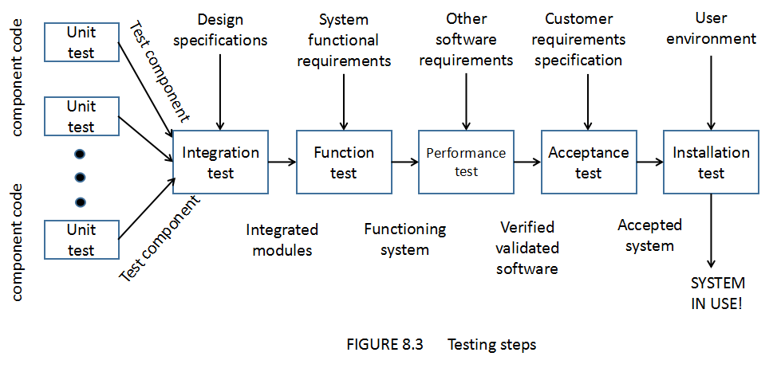

# Testing the System

## System Testing Process
- Testing Steps
> 1. function testing  
> 2. performance testing  
> 3. acceptance testing  
> 4. installation testing  

 
> 系统测试从 `function test` 开始

## Configuration Management
- `system configuration` is a collection of system components delivered(交互) to a
particular customer.
- `Versions and Releases`: A configuration for a particular system is sometimes call
a version. A new release of the software is an improved system intended to replace
the old one.
> For example, aircraft software may be built so that version 1 runs on Navy planes,
version 2 runs on Air Force planes, and version 3 runs on commercial airliners. 

## Test Team(Independence)
- Professional testers
- Analysts
- System designers
- Configuration management representative(代表)
- Users

## Function Testing (黑盒多用)
- Purpose and Roles(目的和作用)
- Cause-and-Effect Graphs(因果图)
> 因果图看不懂，放弃了 

## Types of Performance Testing
- `Stress tests` evaluate the system when stressed to its limits over a short period
of time.
- `Volume tests`(大数据测试) address the handling of large amounts of data in the
system .
- `Configuration tests` analyze the various software and hardware configurations
specified in the requirements.
> 分析需求中规定的各种软件和硬件配置 

- `Compatibility tests`(兼容测试): When a system interface with other systems, find
out whether the interface functions perform according to the requirement.
- `Regression tests`(回归测试) are required when the system being tested is replacing
an existing system. The new system is at least as good as that of old.
> 回归测试结果新系统不能比旧系统差 

- `Security tests` ensure that the security requirements are met.
- `Timing tests` evaluate the requirements dealing with time to respond to a user
and time to perform a function.
- `Environmental tests` look at the system's ability to perform at the installation site.
> 看看系统在安装现场执行的能力 

- `Quality tests` evaluate the system's reliability, maintainability, and availability.
- `Recovery tests` address response to the presence of faults or to the loss of data,
power, devices, or services.
- `Maintenance tests` address the need for diagnostic(诊断) tools and procedures to
help in finding the source of problems.
- `Documentation tests` ensure that we written the required documents.
- `Human factors tests` investigate requirements dealing with the user interface to
the system.

## Reliability, Availability, and Maintainability
### Definitions
- `Software reliability` is the probability that a system will operate without failure
under given conditions for a given time interval.
> 系统在给定条件下、给定时间间隔内无故障运行的概率 
> We want our software to function consistently and correctly over long periods of time. 

- `Software availability` is the probability that a system is operating successfully
according to specification at a given point in time.
> 系统根据规定在给定时间点成功运行的概率 
> We want our software to be available when we need it. 

- `Software maintainability` is the probability that, for a given condition of use,
a maintenance activity can be carried out within a stated time interval and using
stated procedures and resources.
> 给定使用条件，维护活动在规定时间间隔、使用规定程序和资源的执行概率 
> We want our software to be repaired quickly and easily if it does fail. 

## Measuring(度量) Reliability, Availability, and Maintainability
- Mean(平均) Time to Failure(MTTF)
- Mean Time to Repair(MTTR)
- Mean Time between Failures(MTBF)
> MTBF = MTTF + MTTR 
> Reliability = MTTF/(1 + MTTF) 
> Availability = MTBF/(1 + MTBF) 
> Maintainability = 1/(1 + MTTR) 

## Acceptance Testing(验收测试)
- To enable the customers and users to determine if the system We built really
meets their needs and expectations.
- Ways of Testing:
> `Benchmark test`(基准测试): 用户准备一些系统安装过后将会进行的操作用例测试 
> `Pilot test`(试验测试): 在试验基础上安装系统，进行所有功能测试 
> `Alpha test`: 内部测试(In-House) 
> `Beta test`: 外部测试(On-Site) 
> `Parallel testing`: 并行测试(the new system operates in parallel with the previous version) 
